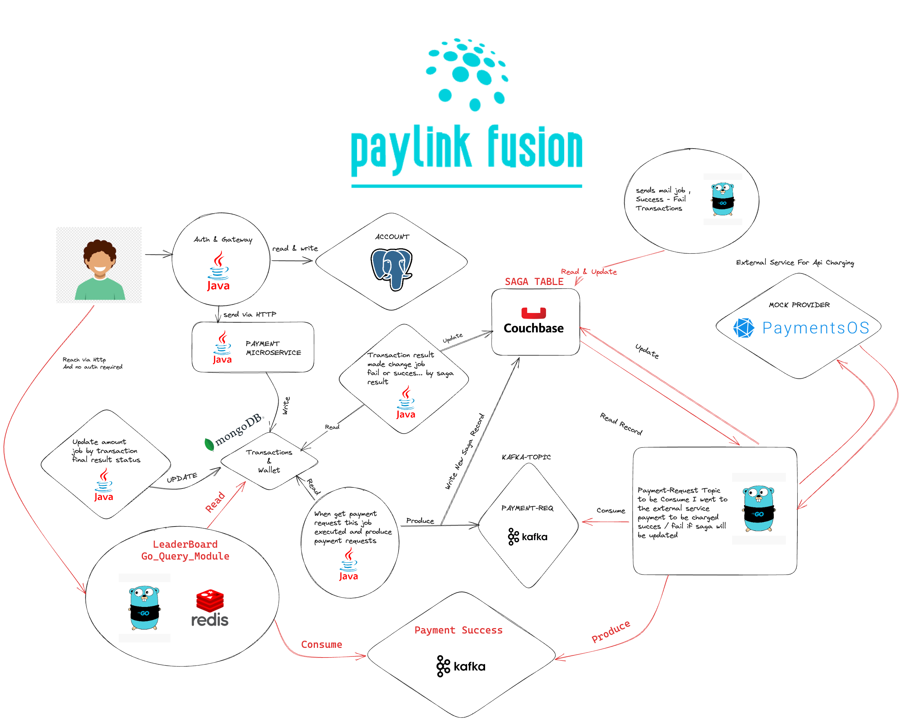

# PAYLINK FUSION PROJECT

## Introduction

This project is a simple payment system that allows users to charge own wallet.<br>
Mainly idea learning how to use GoLang, Spring Boot working together.<br>
Some services written in GoLang, some in Java.<br>
Generally Go and Java services communicate with each other using Kafka.<br>
GoLang services use MongoDB, Redis, Couchbase, PostgreSQL.<br>
Java services use PostgreSQL, MongoDB, Couchbase.<br>

## Architecture



## Prerequisites

- Docker
- Docker Compose
- Kafka
- MongoDB
- PostgresSQL
- Couchbase
- Java 17
- Maven
- GoLang
- Kafka
- Redis


## Attention

- You can run all services with docker-compose.yml file. But you need to change some environment
  variables.
- Need Changes PaymentOS Credentials: `PAYMENT_PUBLIC_KEY` & `PAYMENT_PRIVATE_KEY` and `PAYMENT_APP_ID`.
  You can change these variables in 
    `go-payment-handler-service/config/secret.env` file.


#### Run Infrastructure & Services

```shell
cd infrastructure
docker-compose up -d
```

### What's next?

- [x] Implementing Docker Compose
- [ ] Starting to write documentation
- [ ] Implementing Unit Tests
- [ ] Implementing Integration Tests
- [ ] Starting to frontend development
- [ ] Implementing Kubernetes
- [ ] Implementing CI/CD

## Services

### GoLang

- [x] [Payment Handler](#!)
- [x] [Notification Handler](#!)
- [x] [Query Service](#!)

### Java

- [x] [Auth & Gateway](#!)
- [x] [Payment Service](#!)

## Authors

- [x] [Ali CANLI](#!)


